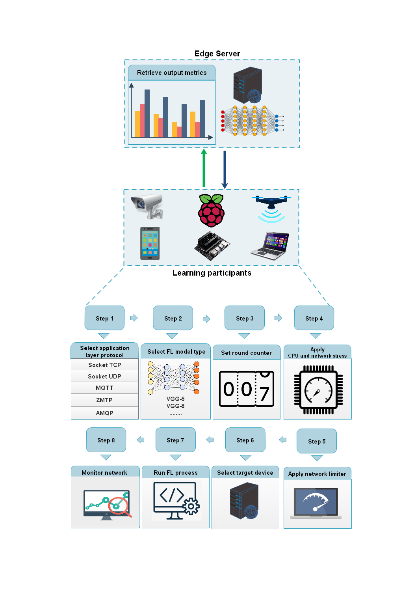

# FedComm:  Understanding Communication Protocols for Edge-based Federated Learning

### About FedComm

FedComm started off as a final year MEng project at Queen's University Belfast and was designed to help evaluate application layer protocols in a variety of environments under varying network conditions to further explore FL and the application layer protocols used for transferring data to build a complete analysis to bring benefits to the FL community.

FedComm was designed to run via the command line, providing a simple interface to interact with and to quickly get the FL process operating with any customizations.
Running FedComm with full customization is an 8 step process (All are optional):

 <ol>
  <li>Select the application layer protocol for communication and transferring FL models</li>
  <li>Select DNN ML model</li>
  <li>Set the number of rounds of the FL process</li>
  <li>Apply network or CPU stress tests</li>
  <li>Select network bandwidth rate</li>
  <li>Enable/Disable monitoring of TCP re-transmission packets</li>
  <li>Select server device</li>
  <li>Run the FL process to initiate FedBench benchmarking method</li>
</ol> 

<p align="center">
  
</p>

### Setting up the environment

The code is tested on Python 3 with Pytorch version 1.4 and torchvision 0.5. In order to test the code, install Pytorch and torchvision on each IoT device (Raspberry Pi and Jetson). The simplest way is to install from pre-built PyTorch and torchvision pip wheel.
All necessary packages can be found in the requirements file.

Then, modify the respective hostname and ip address in `config.py`. CLIENTS_CONFIG and CLIENTS_LIST in `config.py` are used for indexing and sorting.

```
# Network configuration
SERVER_ADDR = '192.168.101.120'
SERVER_PORT = 1883

# Unique clients order
CLIENTS_LIST = ['192.168.101.116', '192.168.101.217', '192.168.101.218', '192.168.101.219']
HOST2IP = {'mars116XU': CLIENTS_LIST[0], 'mars117XU': CLIENTS_LIST[1], 'mars118XU': CLIENTS_LIST[2],
           'mars119XU': CLIENTS_LIST[3]}
CLIENTS_CONFIG = {CLIENTS_LIST[0]: 0, CLIENTS_LIST[1]: 1, CLIENTS_LIST[2]: 2, CLIENTS_LIST[3]: 3} 
```

Finally, download the CIFAR10 datasets manually and put them into the `datasets/CIFAR10` folder (python version). 
- CIFAR10: https://www.cs.toronto.edu/~kriz/cifar.html

### Running FedComm

Clone this repo: 
<br>Via HTTPS ```git clone https://github.com/qub-blesson/FedComm.git```
<br>Via SSH ```git clone git@github.com:qub-blesson/FedComm.git```
<br>Via GH CLI ```gh repo clone qub-blesson/FedComm```

Navigate to the project base, edit the config file as seen in the above section.

Navigate to the FL directory.

Run Run.py from the command line. For example ```python3 Run.py --communicator MQTT --model VGG5 --stress CPU --limiter 4G --rounds 5 --monitor true --target 192.168.0.55```
